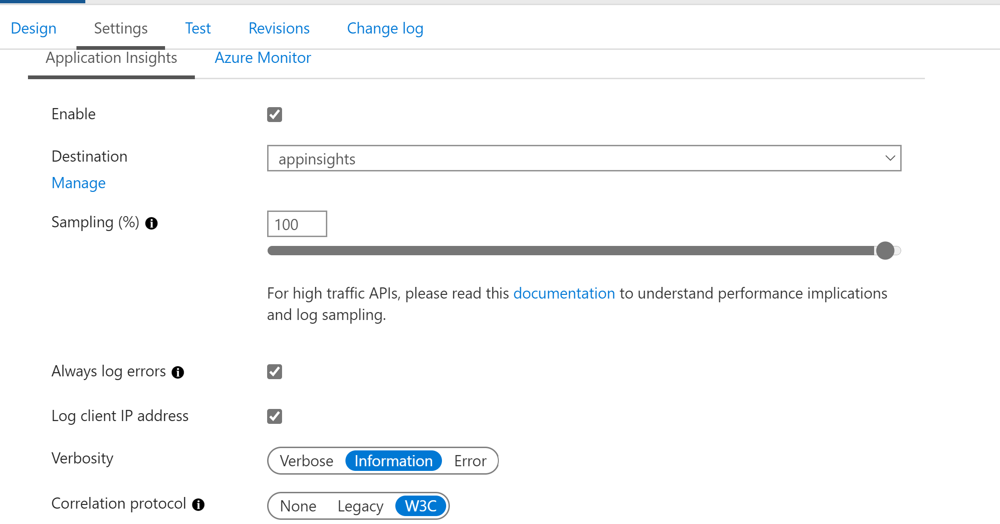

# Azure Application Insights Demo

This repository contains code to demonstrate W3C distributed tracing using Azure Application Insights. The code contains an Angular client and two Spring Boot backend APIs. The Azure Application Insights distributed tracing also works well with an **Azure API Management** layer between client and the backend APIs.

This repository contains 3 code repositories:

1. client - angular client to call backend api
2. service1 - spring boot microservice that calls service2 microservice
3. service2 - spring boot microservice

Set following environment variables before running the service2:  
export INSTRUMENTAION_KEY=#*your azure application insights instrumentation key*#  

Set following environment variables before running the service1:  
export INSTRUMENTAION_KEY=#*your azure application insights instrumentation key*#  
export SERVICE2_URL=#*service2 url*#/hello2   
export COSMOSDB_URI=#*Cosmos DB URI*#  
export COSMOSDB_KEY=#*Cosmos DB Key*#  
export DATABASE=#*Database Name*#  

# How to run backend services
1. Download azure application insights Java agent from:  
https://github.com/microsoft/ApplicationInsights-Java/releases/download/2.6.1/applicationinsights-agent-2.6.1.jar  

2. Execute following command to run the service:  
java -javaagent:#*full path to agent*#/applicationinsights-agent-2.6.1.jar -jar #*name of jar file (service1.jar or service2.jar)*#

**NOTE:** place the AI-Agent.xml from Agent-Configuration folder into the folder that container Java agent jar file

# How to run client

1. Enter Azure application insights instrumentation key and *service1* URL in src/environments/environment.ts
2. Run 'npm install' to download all the dependencies
3. Run 'ng build' to build the application
4. Run 'ng serve' to run the application. The configured port for client application is 8080
5. Use http://localhost:8080 (assuming application is running on localhost) to access the application

# Azure API Management configuration for Application Insights

